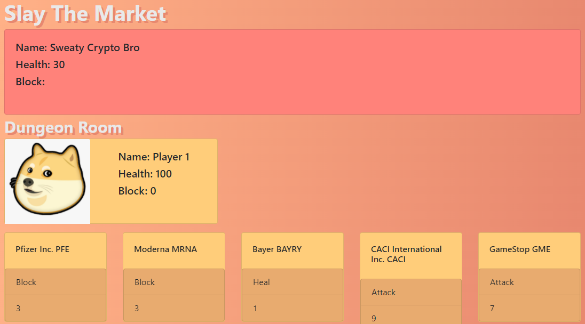

# Slay the Market

---

## Description

A deck building game where you gather stocks to help you survive fighting in randomly generated dungeon! You will fight enemies from around the internet and if you are strong enough you will fight the boss to win the game. This project demonstrates our ability to create a full stack web app using some of the most useful tools currently available. Including: React, graphql, MongoDB, Mongoose, and finnhub to pull realtime stock data.

---

## Table of Contents

[Features](#features)

[Screenshot](#screenshot)

[Installation](#installation)

[Usage](#usage)

[License](#license)

[Contributing](#contributing)

[Tests](#tests)

[Questions](#questions)

---

## Features

      1. Game logic done using React components.

      2. Uses graphql to interact with MongoDB

      3. Uses Bcrypt to safely store users passwords.

      4. Uses express for server functions.

      5. Uses finnhub to get updated stock data.

      6. Uses mongoose as a Object Data Modeling library for MongoDB.

      7. Uses MongoDb as our database solution.

      8. Uses jest as our testing solution.

      9. Uses Apollo to manage both local and remote data with GraphQL.

---

## Screenshot

---

## Installation

      1. Clone the repo

      2. In the terminal type npm install

      3. Or just go directly to Heroku to play

---

## Usage

      1. In the terminal type npm start

      2. Click the link below to play on Heroku!

[Heroku Deployed App ](https://sloansta-slay-the-market.herokuapp.com/)

---

## License

&emsp; 

      To read about the license of this project click the link below.

&emsp;[License](https://github.com/sloansta/slay-the-market/blob/main/LICENSE)

---

## Contributing

      1. Either leave a comment in the issue tracker or email one of the developers

---

## Tests

      1. In the terminal type npm run test

---

## Questions

If you have any questions about this project feel free to email us at <tg.tiburon@gmail.com>, <sloan.boyce@gmail.com>,<Brt9029@gmail.com>, <zacharyburcar@gmail.com> .

Below is a graphic displaying my most used languages on github.

This Readme file was created with Readme Architect by Tony Gendreau &copy;
